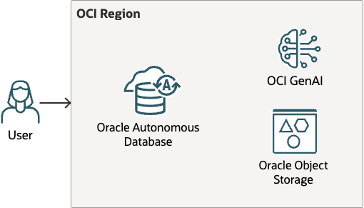
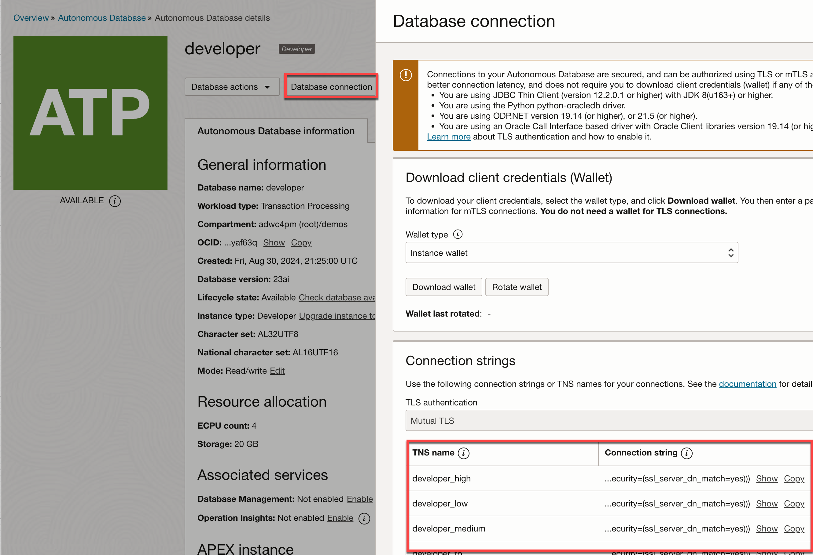

# Create an Autonomous Database on OCI
There are different ways that you can deploy a new Oracle Autonomous Database:
* [Using the OCI Console](https://youtu.be/5BUXoBewZbQ)
* [Using Terraform scripts](https://github.com/oci-landing-zones/terraform-oci-multicloud-azure/tree/main)
* Using the OCI CLI

The steps below show how to create an Autonomous Database using the OCI CLI. 

## Prerequisites:
* [Install the OCI CLI](https://docs.oracle.com/en-us/iaas/Content/API/SDKDocs/cliinstall.htm) 
* [Subscribe to Autonomous Database for free](https://www.oracle.com/autonomous-database/free-trial/) 
* See documentation to ensure you have the appropriate user groups and privileges. 
    * [Deploy Autonomous Database](https://docs.oracle.com/en/cloud/paas/autonomous-database/serverless/adbsb/autonomous-database-iam-policies.html)
    * [Use OCI GenAI](https://docs.oracle.com/en-us/iaas/Content/generative-ai/iam-policies.htm)
    * [Use OCI Object Storage](https://docs.oracle.com/en-us/iaas/Content/Security/Reference/objectstorage_security.htm#iam-policies)

## Deploy your Autonomous Database
Autonomous Database will be deployed on a public endpoint - which will simplify the architecture. The OCI CLI will deploy:
* An Oracle Autonomous Database. It is deployed to a private subnet on that VPC Network. That private subnet is managed by Oracle Database@Google Cloud.
* An Object Storage bucket with sample data
* Sample code will use OCI GenAI (or other AI service).
* Use your computer as a client.




You can run the OCI CLI scripts independently or run `create-all-resources.sh`. Simply update the [`config`](#configuration-file) prior to running the scripts:

|Script|Description|
|----|---|
|[create-compartment.sh](create-compartment-group.sh)|Create a compartment for your Autonomous Database|
|[create-adb.sh](create-adb.sh)|Create an Autonomous Database in the compartment|
|[create-all-resources.sh](create-all-resources.sh)|Creates your resource group, network, ADB and VM|
|[create-data-lake-storage.sh](create-data-lake-storage.sh)|Creates an OCI Object Storage bucket and uploads sample data into that bucket|
|[delete-all-resources.sh](delete-all-resources.sh)|Deletes your compartment, bucket and Autonomous Database|
|[show-adb-info.sh](show-adb-info.sh)|Shows information about your ADB - including you JDBC connection details to the HIGH service|
|[show-data-lake-storage-info.sh](show-data-lake-storage-info.sh)|Shows information about your data lake storage - including the storage endpoint URL|

### Configuration file
The OCI cli deployment scripts rely on settings found in the config file. These resources **will be created** by the scripts. Update the config file prior to running any of the scripts. 

>**IMPORTANT:** This file will contain a password that is used to connect to Autonomous Database and the virtual machine. Set the file's permissions so that only the file's owner can view its contents:
```bash
chmod 600 config
```

|Setting|Description|Example|
|----|----|----|
|TENANCY_OCID|The tenancy Oracle Cloud Identifier. [See documentation](https://docs.oracle.com/en-us/iaas/Content/Identity/tenancy/Viewing_the_Tenancy_Details_Page.htm) for finding the OCID. |"ocid1.tenancy.oc1..aaaaaaaa..."|
|REGION|Region where resources will be deployed. Your tenancy must be subscribed to the region.|"us-ashburn-1"|
|COMPARTMENT|Target compartment for new resources|"development"|
|ADB_NAME|Autonomous Database name. This name must be unique within a region location|"quickstart"|
|BUCKET_NAME|The name of the Object Storage bucket where files will be uploaded|"adb-sample"|
|USER_PASSWORD|The password for the Autonomous Database admin user|"Welcome1234#abcd"|

### Using the scripts
Open a command prompt to deploy all the resources.

Creating all of the resources will take approximately 5 minutes.

```bash
./create-all-resources.sh
```

Check for errors after running the script. If there is an issue, simply rerun the script that creates the resource (note: you may need to update the config file).

## What's next
Connect to your Autonomous Database!
* [Learn about connectivity options](https://docs.oracle.com/en/cloud/paas/autonomous-database/serverless/adbsb/connect-preparing.html)
* Use these great VS Code extensions that help you develop and debug your database apps:
    * SQL Developer for VS Code ([Learn More](https://www.oracle.com/database/sqldeveloper/vscode/) | [Marketplace](https://marketplace.visualstudio.com/items?itemName=Oracle.sql-developer))
    * Oracle Developer Tools for VS Code  ([Learn More](https://docs.oracle.com/en/database/oracle/developer-tools-for-vscode/getting-started/gettingstarted.html) | [Marketplace](https://marketplace.visualstudio.com/items?itemName=Oracle.oracledevtools)) 
* [Use the sample scripts](../../sql/README.md) to learn how to use different features - like Select AI, data lake integration, JSON, and more.


#### JDBC Example:
JDBC is a common way to connect to Autonomous Database. For example, you can use the **Custom JDBC URL** in the VS Code SQL Developer Extension:
    

Notice the `jdbc:oracle:thin:@` prefix followed by a connection string. You can find the connection string in different ways. 

1. Go to your Autonomous Database instance in the OCI Console and click **Database Connections**:


2. Use the OCI cli script [`show-adb-info.sh`](./show-adb-info.sh). That script will return information about your Autonomous Database, including connection details.

<hr>
Copyright (c) 2024 Oracle and/or its affiliates.<br>
Licensed under the Universal Permissive License v 1.0 as shown at https://oss.oracle.com/licenses/upl/
